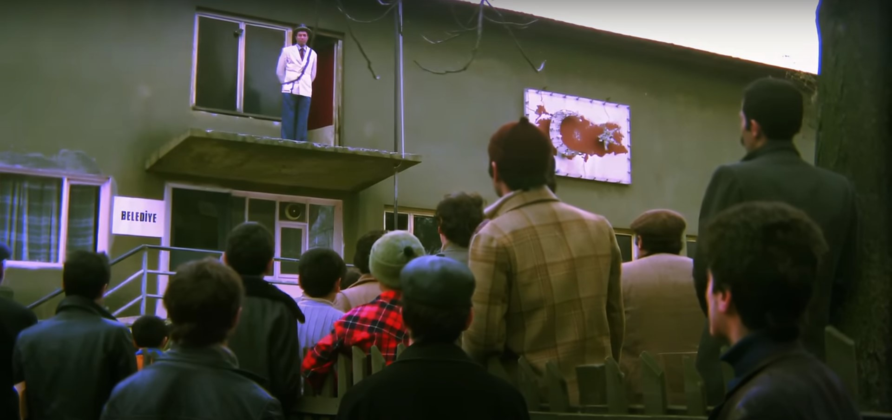

## Floods in The Desert

Day before yesterday, I watched a Turkish movie staring Kemal Sunal called, *Üç Kağıtçı.* The movie's title is a slang phrase that refers to a con-artist who cheats people using the [Three-Card Monty](https://en.wikipedia.org/wiki/Three-card_monte) trick. 

The phrase "Üç Kağıt" translates to "Three Card." And the transliteration of Üç Kağıtçı would be "Three Carder",[^1] alluding to the trickster who orchestrates a short-con using playing cards. As a Turkish colloquial phrase, Üç Kağıtçı refers to any type of a fraudster. 

The movie is a commentary on how some people of the public can be ignorant and uneducated enough to blindly believe in false prophets and religious leaders, particularly in charismatic persons who make bogus claims about having abilities to create miracles such as, making rain pour from skies via their "spiritual powers." Those sheepish and servile followers, often depicted as backwardly, poor, and desperate villagers, are too eager and willing to elect a person they find mysterious and "spiritually powerful", as their local government's leader, without putting in the effort to understand the role of basic sciences and proper political governance, in their daily lives. Those people, are depicted in the movies as individuals who quickly judge someone as trustworthy and infallible in a knee-jerk reaction, while denouncing any newcomer as an untrustworthy liar, based on preconceived biases and superstitions. The rough-neck villagers are shown as people who make decisions without verifying the essential and pertinent details of a situation, that would otherwise require those people to cast their vote of confidence.   

In the movie, the actor Kemal Sunal portrays a simple middle-aged man called *Rıfkı* with rheumatoid arthritis in his knees, who is able to "accurately predict" rainfall, due to sudden pain in his knees. As soon as he feels discomfort due to rheumatism in his knees, he tells people around him that it is sure to rain within half an hour. People around him tend to disbelieve him because they see no other signs of rain in a cloudless sky, so they place bets against him to test his claims. The villagers treat him as a trickster or a "Üç Kağıtçı" who is out to con them. 

The movie's narrative shows that it rains heavily, all of a sudden, each time the village people test the protagonist's confidence in his predictions upon placing their bets against him. The villagers "put their money where their mouth is," and end-up loosing their money and face to Rıfkı, including village elders who are supposed to be wise and clever. Through such repeated wins, the protagonist gains a great deal of popularity, fame, and money. A series of silly and comedic happenstance follow, which propel Rıfkı to becoming the village's mayor. The mayoral position is viewed by the local people as the most respected and powerful seat of esteem and authority, in their village. And the villagers also start to view Rıfkı as a "shaman" or a "god-man", who can cure handicapped or diseased people, by "blowing air" on them from his mouth. By the end of the movie, the protagonist admits to people that he was only lucky in predicting the potential for rain, because of his special and peculiar knee pain caused by sudden weather changes, and also to the fact that all of his other predictions eventually became true, only because of various other, non-mysterious reasons. The villagers accept him for who he is and continue to have him as their mayor, deciding that he wasn't an Üç Kağıtçı or a con-artist, after all.  

The movie is a subtle parody of rural society in Turkey during nineteen-eighties, and is a commentary that is still relevant during current day and age, within countries like Turkey, Iran, India, and China, where certain local and national leaders are seen by some international observers and multimedia commentators as, "snake charmers" dressed in a holy garb.  

The true merit of leadership and scientific acumen in a person, is often too difficult to grasp for most members of the common public. Many good as well as bad leaders, take advantage of this fact, to promote their personal motives and agenda in the name of doing public good. Which one of us can possibly be a legitimate and worthwhile judge of our own character and that of others, is the ultimate question posed by the movie. 

 

    </img>
     
    
A scene from the movie, <b><a href="https://tr.wikipedia.org/wiki/%C3%9C%C3%A7_Ka%C4%9F%C4%B1t%C3%A7%C4%B1_(film)">Üç Kağıtçı</a></b>
     Sonuçta, bir dürüst ve namuslu adamdı.

 

### Volunteerism and Individual Civic Duties

Now, various sets of data that I frequently obtain via publicly available, open-sourced intelligence (OSInt), cause me to become aware of certain types of eventualities that can impact industrial, economic, political, and military supply chains within particular regions of the world. I've tried to explain the manner in which I receive open-sourced data and how I then generate inferences based on "insights", via these articles:

- [Browser Hardening](https://github.com/my-realm/musings/blob/main/browser-hardening.md)

    - [Firefox User Prefs - Readme](https://github.com/psyedout/firefox-user-prefs/blob/main/README.md)

- [Intuitive Method of Constructing a Semantic Model of a Given System](https://github.com/callthis/status-quo/blob/main/docs/01-02-09.md#1294-intuitive-method-of-constructing-a-semantic-model-of-a-given-system) 

- [The Value of Things and Intelligence](https://github.com/callthis/fiction/blob/master/the-value-of-things-and-intelligence.md#the-value-of-things-and-intelligence) 

- If you are "super gung-ho", you can read this article and follow its links - [Online Comms](https://github.com/callthis/fiction/blob/master/online-comms.md#online-communications-within-a-publicly-accessible-channel)

However, the above types of explanations might not appear palatable, or scientific, or legitimate, or "legal", to various readers. Whether anybody else believes in what I have to post in the public domain or not, my main challenge has always been the question, "should I actually care about people in other parts of the world, and if I do care, what can I voluntarily do about it?"  

When I had obtained some data last year, about imminent flooding in Fresno County, California, I had tried to warn a fire station there to [become better equipped and prepared](https://github.com/psyedout/tweets/blob/a46401e79752451b36393c0c5c1c712713d60bfc/tweets.json#L8041), for a seemingly impossible event that American weather reports wouldn't have confirmed or corroborated at that time. Did that warning, alert Fresno County officials to take appropriate measures to protect against flooding, and then, did that alert generate any positive results? I have no idea. A mere Tweet as an alert, may or may not have helped those early responders and the denizens of that county. The only reason I bothered to send them that alert, was because I was not uncertain about the validity and authenticity of my inference of the publicly available data. It is a rather rare occurrence for me, *to not be uncertain* about an eventuality. 

The whole point of catching data that slips through "the cracks in the system", is to find ways to make judicious use of that vital data, and to patch the system to prevent those types of errors and lapses from occurring in the future. In voluntarily fulfilling such an open ended task, I only happen to have the authority and social power, of a random person on the internet, who may bring forth a seemingly "spurious", or a "questionable", or a "debatable" claim, to the attention of elected or appointed authority figures. Those officials are supposed to have the actual responsibility of economically obtaining intelligence reports, and to then appropriately act upon those reports. Of course, I wouldn't receive any data at my vantage point in the first place, if there were no holes or cracks in their data gathering and analytical report generating mechanism.   

I only managed to find flaws and errors at the systemic and foundational level, of their "international rules based order" and "public security systems", when I started looking at the reasons and institutional functions that allowed Canadian public-service units to forcibly violate my family and me. 

The public infrastructure necessary, to prevent the types of cyber-attacks that I had suffered during the years 2019 and 2020 while residing in Kitchener, Ontario, Canada, simply did not exist in Ontario, though the public records indicated that institutions such as the Communications Security Establishment (CSE) of Canada, had already spent their yearly budgets on building and maintaining those safety and security infrastructure measures to protect Ontarians. 

The more insidious and systemic nature of those cyber-attacks, was revealed to me when local agents and agencies operating in Ontario fabricated statements in a writ, to have me arrested on the false charges of being a malevolent mercenary. Furthermore, to this day, "Police Interaction Records" obtainable from the Waterloo Regional Police Services (WRPS) in Ontario show that, I have never been arrested by them. And yet, they did arrest me, after which they illegitimately detained me in a substitute jail and repeatedly tortured me and put me through immense torment only because they wanted to repress me for being a male-Muslim-Asian. 

So, should I pity those people in Canada who violated me because of their routine, obtuse, xenophobic, and Islamophobic cultural ideals and systemic policies? Should I bother to warn them and their families, about various "eventualities" that are about to drastically and permanently reshape the physical design of their cities and homes? Should I care about bystanders in Canada when mainstream media groups and authority figures in North America, possibly cannot show genuine care and consideration for bystander in Palestine and Syria? 

Of course, caring about innocent civilians in any part of the world, other than ones in Israel, seems to be taken by Zionists as a political statement against "The Chosen Kingdom of YAHW!" Zionists would also like to be called the only people blessed and chosen by All Mighty God, as if there was a shortage of people on this Earth claiming to be dissidents of God, or claiming to be something like "Surya-Vanshi", "Göktürk", "Bhumi-Putra", et cetera. 

And so what if I were to warn those wrongdoers in Canada or their seemingly guilt-free supervisors? Won't things I say merely be labeled by them and their supervisors as "fake news", or as "vagrant thoughts and rants?" Will they bother to actually pay heed? Do you suppose they could possibly do anything other than to pathologize or criminalize me and my writings? If they could, do you think they would have continued to behave as colonialist bigots, with systematic prejudices and irrational phobias against women, people of color, and minorities, baked into the everyday practices of their private and public organizations? 

I've grown tiered now, I don't have a whole lot of enthusiasm anymore for activism, or for "speaking 'the truth' to the powers that be." 

Yesterday, when I started noticing data about yet another massive flood in a dessert, I didn't bother to find out which dessert and which part of the world. Apparently, at the present moment in human history, parts of Russia at the footsteps of the Ural Mountains near Kazakhstan as well as parts of Kazakhstan are flooded. 

Also, currently, parts of United Arab Emirates (UAE) are inundated due to heavy rains. Cities like Dubai, UAE have the same town planning issues that cities like Los Angeles, California, and Huston, Texas have; that is, too much concrete and asphalt strewn about the entire city with no consideration for ecological balance. 

>What could have anybody in UAE done if I had reached out to them? What can mere humans do in the face of Allah's Wrath? 

We could very well put aside destructive implements and tools of warfare, to better focus on utilizing constructive designs of modern sciences to improve access to appropriate shelter, water, food, medicine, clothing, electrification, mobility, and education for all human beings. Or maybe we simply cannot do that, because something more powerful within ourselves prevents us from respecting poor and innocent bystanders who do not wish to be caught up violence and warfare. 

It is entirely obvious that supremacists would like each of us to abandon the path of non-violence, and to instead adopt the path of hatred and conquest, for the sake of hating and conquering "weaker and inferior peoples." According to supremacists, the ultimate conqueror among mortal human beings from "the master race", is the only one capable of deciding the level of social status, moral worth, economic value, and political position that needs to be ascribed to respective human individuals, within a so-called "divinely ordered and ordained" hierarchy of all beings, in the entire mother-freaking Universe! 

However, all of the money in the world could not have helped the people of UAE, to evade or hide from the flood that has already hit them, even if they had seen it coming using the hindsight available to them from a year ago, because, all the material wealth in the world will not help rescue them, from the floods and storms they will encounter next year, unless they wake up and prioritize ecological upliftment and sustainability over profits from fossil fuel sales. 

The UAE, similar to Singapore, is only a fraction of the size of Ontario in terms of landmass and population, with more liquid cash and monetary assets available to them for disaster recovery, than to the whole of Canada. And yet, they are at a loss in terms of preparedness for dealing with natural and human engineered calamities. So, what exactly are Canadians and Americans going to do when it comes to fighting a full-scale war against Russia and China on all global fronts, particularly when Americans and Canadians cannot afford to allocate anymore resources towards local disaster recovery from earthquakes, sinkholes, tornadoes, wildfires, floods, blizzards, hail storms, hurricanes, pestilence, and all other natural calamities? 

[^1]: Transliteration of Üç Kağıtçı in Hindi is, "तीन पत्तों वाला"